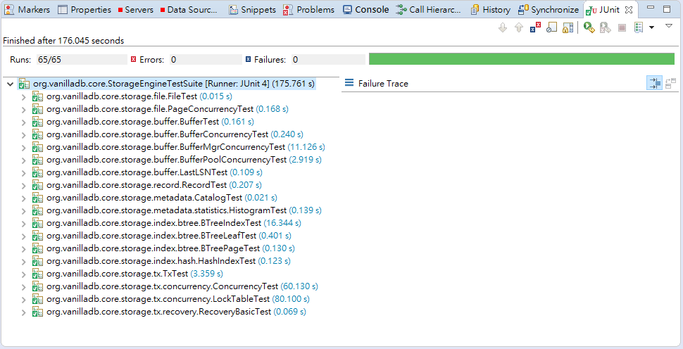

# Contributing to VanillaCore

Thank you for your interest in contributing to VanillaCore ! There are many ways to contribute, and we appreciate all of them:

- [Feature Requests](#feature-requests)
- [Bug Reports](#bug-reports)
- [Pull Requests](#pull-requests)

## Feature Requests

To request a feature for VanillaCore, please open an issue [here][1].

## Bug Reports

Since many components of this project are still fresh, you may find lots of bugs while using VanillaCore. If you're not sure if something is a bug or not, feel free to file a bug anyway.

If you have the chance, before reporting a bug, please search existing [issues][2], as it's possible that someone else has already reported your error. This doesn't always work, and sometimes it's hard to know what to search for, so consider this extra credit. We won't mind if you accidentally file a duplicate report.

In order to let us reproduce the bug, we recommend to use our template:

```markdown
<short summary of the bug>

## What I Did

<the action that caused the bug>

## What I Expected To See

<explanation>

## Instead, what actually happened

<explanation>

```

## Pull Requests

Pull requests are the primary mechanism we use to change VanillaCore. GitHub itself has some [great documentation][3] on using the Pull Request feature. We use the **fork and pull** model described there.

Please test your code before opening pull requests and make pull requests against the `master` branch.

VanillaCore has a few JUnit test cases to check if all of the modules work properly. We recommend to use Maven to run the tests. Or, another way we usually use is to use JUnit plugin in Eclipse to run.

If you use Maven with command: `mvn test`, here is a result of passing all of the tests:

```
Results :

Tests run: 65, Failures: 0, Errors: 0, Skipped: 0

[INFO] ------------------------------------------------------------------------
[INFO] BUILD SUCCESS
[INFO] ------------------------------------------------------------------------
[INFO] Total time: 01:24 min
[INFO] Finished at: 2017-07-13T13:58:26+08:00
[INFO] Final Memory: 23M/264M
[INFO] ------------------------------------------------------------------------
```

If you run use Eclipse, please right click on `StorageEnglineTestSuite` in `org.vanilladb.core`, then select `Run As` > `JUnit Test`. Here is a screenshot of passing all of the tests:



[1]: https://github.com/vanilladb/vanillacore/issues
[2]: https://github.com/vanilladb/vanillacore/issues?utf8=%E2%9C%93&q=
[3]: https://help.github.com/articles/using-pull-requests/
